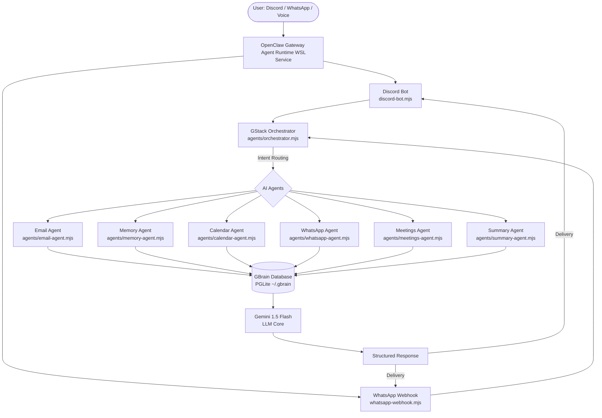

# 🎙️ Personal AI Assistant for Workplace Productivity


[](package.json)
[](package.json)
[](package.json)
[]()

An intelligent, multi-agent workplace productivity assistant powered by **Gemini 1.5 Flash** and integrated with **OpenClaw Gateway**, **GBrain (PGLite)**, **Discord**, and **WhatsApp**. This assistant acts as a cognitive extension, automatically fetching emails, summarizing meetings, organizing calendar events, tracking tasks, and providing conversational intelligence directly in your chat apps.

---
hi
## 🏗️ Architecture & Data Flow

The project is built on **GStack** (an orchestrator that uses Gemini to route intents) and integrates with **GBrain** (a local vector database and knowledge base backed by PGLite).



### Automated Background Pipelines
*   **Email Pipeline:** Every 30 minutes, a cron job fetches new messages via the Gmail API, extracts full bodies, saves them to OpenClaw's memory files (`~/.openclaw/workspace/memory/`), and imports them into `GBrain`.
*   **Daily Digest Pipeline:** Triggered at 8:00 AM daily, queries `GBrain` (emails, tasks) and Google Calendar (daily events) to assemble a productivity brief delivered directly to Discord.

---

## ✨ Key Capabilities

### 📧 Email Integration & Smart Summaries
*   **Automatic Ingestion:** Automatically fetches and processes emails in the background.
*   **Semantic Search & Filtering:** Filter emails by sender or search contextually using natural language.
*   **AI Digest:** Synthesize today's emails into key summaries, extracting action items, deadlines, and urgent tasks.

### 📅 Calendar & Meeting Preparation
*   **Agenda Tracking:** Retrieve today's schedule or upcoming events.
*   **Meeting Prep:** Retrieve contexts, previous email exchanges, and related notes before stepping into meetings.
*   **Custom Meeting Processor:** Upload recording files (`.mp3`, `.wav`, `.webm`) to transcribe, analyze, extract key decisions, and store them directly in the memory database.

### 💬 WhatsApp Integration
*   **Automated Webhook Receiver:** Listens for incoming WhatsApp messages on port `3002`.
*   **Conversation Memory:** Logs chat content to GBrain for search and context retrieval.
*   **Intelligent Auto-Response:** Formulates contextual replies utilizing the workspace's collective memory.

### 🎙️ Discord Voice Interface
*   **Voice Messages:** Upload audio notes/messages directly into Discord, which are automatically transcribed using Gemini 2.0 Flash Lite and routed as assistant commands.

---

## 📂 Project Structure

```
├── agents/                      # AI Agents for task routing and specialized handling
│   ├── calendar-agent.mjs       # Google Calendar tasks & event prep
│   ├── email-agent.mjs          # Email extraction, search & summarization
│   ├── meetings-agent.mjs       # Meeting summaries and Fireflies integration
│   ├── memory-agent.mjs         # Multi-source knowledge indexing & retrieval
│   ├── orchestrator.mjs         # GStack Intent Router powered by Gemini
│   ├── summary-agent.mjs        # Daily status reporter generator
│   └── whatsapp-agent.mjs       # WhatsApp log analyzer and messenger
│
├── lib/                         # Integration clients and wrappers
│   ├── calendar-client.mjs      # Google Calendar API wrapper
│   ├── fireflies-client.mjs     # Fireflies.ai GraphQL Client (Optional)
│   ├── gbrain-client.mjs        # GBrain database interactions
│   ├── gemini-client.mjs        # Gemini API configurations
│   ├── gmail-client.mjs         # Gmail API fetches and authentication
│   ├── meeting-summarizer.mjs   # Summarizer utilities for meeting recordings
│   ├── meeting-transcriber.mjs  # Multimodal audio-to-text transcriber
│   ├── openclaw-client.mjs      # OpenClaw CLI driver 
│   ├── voice-handler.mjs        # Discord audio transcriber agent
│   └── whatsapp-client.mjs      # Meta WhatsApp API helper
│
├── scripts/                     # Operational automation scripts
│   ├── daily-report-cron.mjs    # Scheduled daily digest pipeline
│   ├── ingest-emails-to-memory.mjs # Email background synchronization
│   ├── process-meeting.mjs      # Audio processor CLI tool
│   ├── setup-workspace.sh       # Script for initial workspace bootstrap
│   └── sync-to-gbrain.sh        # Bulk imports files from memory to GBrain
│
├── config.mjs                   # Central config module
├── discord-bot.mjs              # Discord Bot entry point
├── whatsapp-webhook.mjs        # Webhook API Endpoint for WhatsApp
├── start.mjs                    # Main startup script
└── package.json                 # Project dependencies & startup scripts
```

---

## ⚙️ Setup & Installation

### 1. Prerequisites
Ensure you have the following installed on your machine:
*   [Node.js](https://nodejs.org/) (v18.x or higher)
*   [WSL (Windows Subsystem for Linux)](https://learn.microsoft.com/en-us/windows/wsl/install) - recommended for running background cron daemons and OpenClaw services.

### 2. Dependency Installation
Clone the repository and install npm packages:
```bash
npm install
```

### 3. Environment Configuration
Create a `.env` file in the root directory (based on `.env.example`):
```env
# Discord Token & Channel
DISCORD_TOKEN=your_discord_bot_token
DISCORD_CHANNEL_ID=your_discord_channel_id

# Gemini API Key
GEMINI_API_KEY=your_gemini_api_key

# WhatsApp Business API (Optional)
WHATSAPP_PHONE_ID=your_whatsapp_phone_number_id
WHATSAPP_BUSINESS_ID=your_whatsapp_business_id
WHATSAPP_ACCESS_TOKEN=your_meta_system_user_token
WHATSAPP_VERIFY_TOKEN=personal_ai_assistant_verify
WHATSAPP_WEBHOOK_PORT=3002

# Fireflies.ai API (Optional)
FIREFLIES_API_KEY=your_fireflies_api_key

# Custom Configs
INGESTION_INTERVAL=30
DAILY_REPORT_HOUR=8
DAILY_REPORT_MINUTE=0
```

### 4. Authenticate Google APIs
Run the authentication script to authorize the assistant to access your Gmail and Google Calendar. This will prompt a browser login.
```bash
npm run auth
```
> [!IMPORTANT]
> The auth script requests `gmail.readonly` and `calendar.readonly` scopes. Ensure you grant full permissions during the Google OAuth flow.

---

## 🚀 Running the Assistant

### Startup Scripts
The project comes with several scripts configured in `package.json`:

| Command | Action |
|---------|--------|
| `npm run start` | Runs the main process (starts Discord bot, WhatsApp webhook, and ingestion pipeline). |
| `npm run bot` | Starts ONLY the Discord Bot service. |
| `npm run whatsapp` | Starts ONLY the WhatsApp Webhook endpoint server (port 3002). |
| `npm run digest` | Manual trigger for compiling and printing email digests. |
| `npm run ingest` | Fetch emails and write them to OpenClaw workspace memory. |

### Cron Setup (Background Sync)
To run automated workflows continuously in the background using WSL:

1.  **Email Sync (Every 30 mins):**
    ```bash
    (crontab -l; echo "*/30 * * * * cd /mnt/c/Users/botsa/email-collector && node scripts/ingest-emails-to-memory.mjs >> cron.log 2>&1") | crontab -
    ```
2.  **Daily 8:00 AM Report:**
    ```bash
    (crontab -l; echo "0 8 * * * cd /mnt/c/Users/botsa/email-collector && node scripts/daily-report-cron.mjs >> cron.log 2>&1") | crontab -
    ```

---

## 💬 Command Reference

Interact with the assistant through Discord using the following prompt patterns:

### Email Commands
| Query Pattern | Result |
|---|---|
| `search emails about [topic]` | Performs full-text keyword/semantic search across GBrain database. |
| `search emails from [sender]` | Retrieves messages originating from a specific sender. |
| `summarize today's emails` | Evaluates all of today's incoming mails and outputs a high-level briefing. |
| `show pending action items` | Extracts actionable requests, commitments, and deadlines. |

### Calendar & Meetings Commands
| Query Pattern | Result |
|---|---|
| `what meetings do I have today` | Retrieves daily schedule from Google Calendar. |
| `prepare me for [meeting/person]` | Generates background intelligence matching the person/meeting topic from emails & past logs. |
| `show recent meetings` | Retrieves meeting reports stored inside the GBrain knowledge base. |
| `node scripts/process-meeting.mjs file.mp3` | Manual CLI trigger to transcribe, summarize, and record meeting details. |

### WhatsApp Commands
| Query Pattern | Result |
|---|---|
| `search WhatsApp about [topic]` | Search logged chats inside WhatsApp agent history. |
| `summarize WhatsApp chat` | Summarize recent conversations recorded over the WhatsApp integration. |

---

## 🛠️ Infrastructure File Paths (WSL default)

*   **GBrain Local DB:** `~/.gbrain/brain.pglite`
*   **OpenClaw Configuration:** `~/.openclaw/openclaw.json`
*   **OpenClaw Workspace Memory:** `~/.openclaw/workspace/memory/`
*   **Google API Token Cache:** `./token.json`
*   **Workspace Environment:** `./.env`

---

## ⚠️ Current Limitations & Roadmap

1.  **Vector Embeddings:** Currently utilizes full-text search (FTS) fallback in GBrain due to standard local model token format structures. (Adding support for OpenAI/Vertex embeddings is planned).
2.  **Meeting Audio Capture:** The application handles recorded files uploaded manually. Real-time background screen/system-audio tracking is slated for future updates.
3.  **Active Webhooks:** Free ngrok tunnel sessions expire and modify target endpoints. Production use requires a reserved static ngrok address or dedicated domain gateway.
